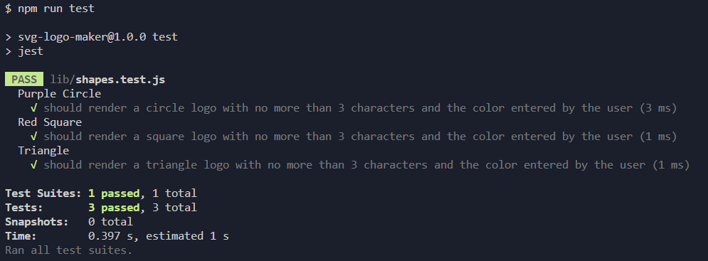
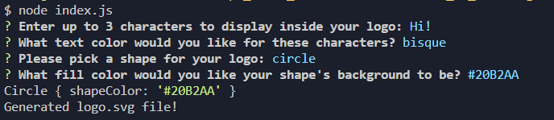

# SVG Logo Maker
> Module 10 - Object-oriented Programming: SVG Logo Maker

This is a Node.js command-line application that takes in user input to generate a logo and save it as an SVG fileLinks to an external site.. The application prompts the user to select a color and shape, provide text for the logo, and save the generated SVG to a .svg file.


## Table of Contents
  * [Demo](#demo)
  * [Screenshots](#screenshots)
  * [Installation](#installation)
  * [Usage](#usage)
  * [Contributing](#contributing)
  * [License](#license)
  * [Questions](#questions)
<br><br>

## Demo
Here is the Application Demo:<br><br>
[Link to video Demo ➡️](https://drive.google.com/file/d/13NkIIsRzhHnStwo339Fk1UFPMev-BwOd/view)

https://github.com/CypherNyx/Make-an-SVG-Logo-with-Node/assets/133705303/09b69640-0a32-4535-98c1-a6fac96e66f4

 <br><br>
### Sample Images:


## Screenshots
<br><br>


<br><br>

## Installation
To create your svg logo first, you'll need to have Node.js installed on your computer. Once you have Node.js set up, you can follow these steps to install and use the application:

1. Clone this GitHub repository to your local machine. <br> 
```sh
git clone https://github.com/CypherNyx/Make-an-SVG-Logo-with-Node.git
```
2. Open a terminal or command prompt and navigate to the cloned repository's directory.
3. Run ```npm install``` to install the necessary dependencies.

## Usage
To generate your SVG icon, follow these steps:

1. Open a terminal or command prompt and navigate to the SVG logo maker directory.
2. Run the application using the command <br>
```sh
node index.js
```
3. Answer the prompted questions about your application repository.
4. Once you have provided all the required information, the application will generate a file named logo.svg in the same directory
5. Open the new "logo.svg" file in VS Code and if you press alt + B, this will open the image on your default browser where you can check the final result. Now you are ready to rename the file and move it to it's final destination, enjoy!

## Contributing
1. Fork it (<https://github.com/CypherNyx/Make-an-SVG-Logo-with-Node/fork>)
2. Create your feature branch (`git checkout -b suggest/new-feature`)
3. Commit your changes (`git commit -m 'Add some new-feature'`)
4. Push to the branch (`git push origin suggest/new-feature`)
5. Create a new Pull Request

## License
[](https://opensource.org/licenses/MIT)
  
  https://opensource.org/licenses/MIT 

## Questions
If you have any questions or need further assistance, you can reach me via the following:

  GitHub: [Dahlia Guido's GitHub](https://github.com/CypherNyx) <br>
  Email: dguido.dev@gmail.com


